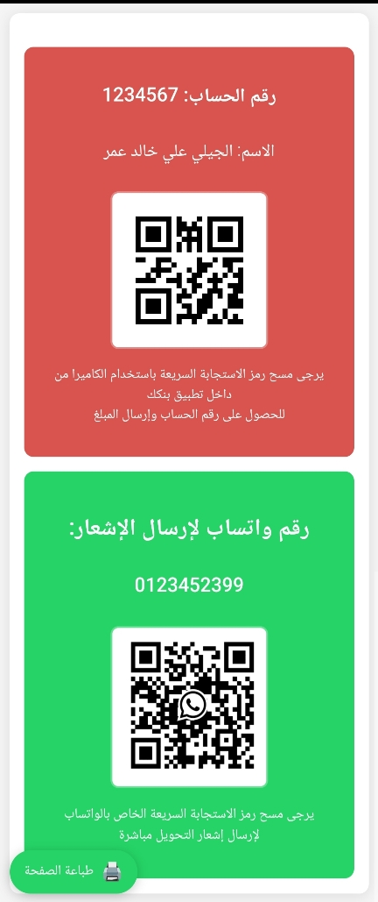

# صفحة معلومات الحساب البنكي مع رمز الاستجابة السريعة (QR)

[تم نشر المشروع علي هذا الرابط](https://bankak-design.netlify.app/) 

مشروع لعرض معلومات الحساب البنكي لدفع الأموال ورقم واتساب لإرسال إشعارات التحويل، مع ميزة  طباعة التصميم. 

## شكل المشروع

## الميزات

- عرض رقم الحساب والاسم ورمز QR البنكي.
- قسم منفصل لرقم واتساب ورمز QR الخاص به.
- تصميم متجاوب يعمل على جميع الشاشات.
- زر طباعة مخصص.
- تحسين تنسيق الصفحة المطبوعة (نسختين لكل صفحة).

## المتطلبات

- متصفح ويب حديث 
   - يدعم HTML5 وCSS3. 
  - ويدعم ميزة الطباعة. 

## الإعداد

1. استبدل الصور التالية بملفاتك الخاصة:
   - `QRimage.jpg`: رمز QR البنكي.
   - `wa-QRcode.jpg`: رمز QR لواتساب.
2. عدل المعلومات التالية في الملف `index.html`:
   - رقم الحساب (`1234567`)
   - الاسم (`الجيلي علي خالد عمر`)
   - رقم واتساب (`0123452399`)
3. افتح الملف في متصفحك.

## كيفية الاستخدام

- **عرض المعلومات**: افتح الصفحة لعرض تفاصيل الحساب وأقسام الواتساب.
- **الطباعة**: انقر على زر "طباعة الصفحة" لإنشاء نسخة ورقية مُحسنة.
  - ستظهر صفحة الطباعة بنسختين من البطاقة لتوفير الورق.
  - التنسيق التلقائي للطباعة بالأبيض والأسود مع حدود واضحة.
- **التوافق مع الهواتف**: التصميم يتكيف تلقائيًا مع الشاشات الصغيرة.

## تخصيص التصميم

يمكنك تعديل الألوان والأنماط عن طريق:
- تغيير قيم الألوان في CSS (مثل `#d9534f` للقسم البنكي، `#25D366` لزر الطباعة وواتساب).
- ضبط أبعاد صور QR من خلال كلاس `.qr-image`.
- تعديل حجم الخطوط والهوامش في الأقسام المختلفة.

## ملاحظات مهمة

- تأكد من تحديث رموز QR عند تغيير معلومات الحساب أو رقم الواتساب.
- عند الطباعة، اختبر النتيجة باستخدام "معاينة الطباعة" قبل الطباعة الفعلية.
---

**تم التطوير بواسطة** الصادق احمد 
